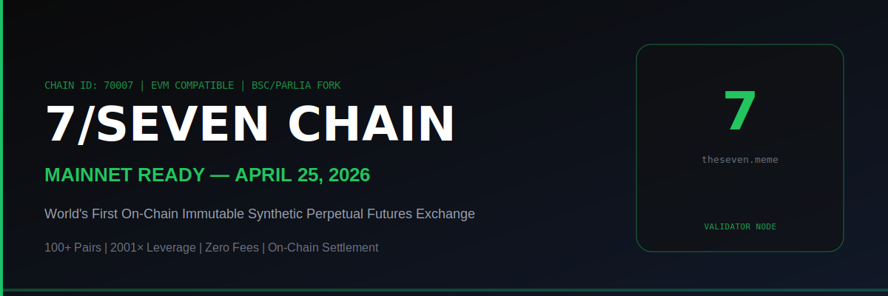

<div align="center">



# 🟢 7/Seven Chain — Validator Node

### **⚡ MAINNET READY — LAUNCHING APRIL 25, 2026 ⚡**

[](https://theseven.meme)
[](https://theseven.meme/become-validator)
[](https://t.me/thesevenmeme)
[](https://theseven.meme)
[](https://theseven.meme)
[](LICENSE)

**World's first on-chain immutable synthetic perpetual futures exchange — powered by 7/Seven Chain**

[🌐 Exchange](https://theseven.meme) • [📋 Become a Validator](https://theseven.meme/become-validator) • [🏆 Leaderboard](https://theseven.meme/become-validator#leaderboard) • [💬 Telegram](https://t.me/thesevenmeme) • [📞 Contact](#contact)

</div>

---

## 🚀 MAINNET ANNOUNCEMENT — APRIL 25, 2026

> **Seven Chain Mainnet goes live on April 25, 2026.**
>
> Validator onboarding is **OPEN NOW**. Secure your position before mainnet launch and earn rewards from day one.
> Validator slots are limited — first-come, first-serve.

The Seven Chain is the public settlement ledger for [TheSeven.meme](https://theseven.meme). Every trade open, close, liquidation, and profit payout is written as an immutable on-chain transaction. You help settle them all — and get paid for it.

---

## 💬 JOIN THE VALIDATOR COMMUNITY

> **Ready to become a validator? Start here:**

### 📣 [Join our Telegram → t.me/thesevenmeme](https://t.me/thesevenmeme)

Connect with the Seven Chain team and existing validators directly on Telegram. Get:
- 🔔 Real-time mainnet launch updates
- 🛠️ Technical support from the team
- 💰 Reward announcements and airdrop alerts
- 🤝 Direct access to the validator community
- 📊 Volume share and fee distribution updates

### 📧 Email Us for Full Support

| Purpose | Email |
|---------|-------|
| General & Validator Inquiries | **info@theseven.meme** |
| Technical Support & Node Help | **support@theseven.meme** |
| SEVEN OTC Purchases | **info@theseven.meme** |
| Strategic Partnerships & Parliament | **info@theseven.meme** |

> 📧 Email with subject **"Validator Inquiry"** — one of our team will reach out personally to guide you through the entire onboarding process.

---

## 💰 VALIDATOR REWARDS — COMPLETE PACKAGE

### 🔷 Reward Type 1 — Relay Fees (Per Block / Per Trade)

Every trade on TheSeven.meme generates a **relay fee paid directly to the validator** who seals that block:

| Network | Relay Fee Per Trade | USD Equivalent |
|---------|-------------------|----------------|
| **BNB Chain** | **0.0004 BNB** | **~$0.25** |
| **Ethereum** | Equivalent in ETH | ~$0.25 |
| **Solana** | Equivalent in SOL | ~$0.25 |
| **USDC / USDT** | $0.25 stablecoins | $0.25 |

- Fees accumulate **automatically** to your validator coinbase address
- No manual claiming — it's all on-chain
- The more trades processed, the more you earn

---

### 🔷 Reward Type 2 — Daily Volume Share

Validators earn a **proportional share of total daily trading volume** on TheSeven.meme:

| Validator Tier | Volume Share Multiplier | Requirement |
|---------------|------------------------|-------------|
| Bronze (PoA) | **1×** base share | No stake needed |
| Silver (PoS) | **1.5×** share | 5,000 SEVEN staked |
| Gold (PoS) | **2×** share | 10,000 SEVEN staked |
| Parliament | **3×** share | 50,000+ SEVEN staked |

> The higher your stake, the greater your slice of the daily volume pool.

---

### 🔷 Reward Type 3 — Staking Rewards (SEVEN Token)

Stake **SEVEN tokens** as collateral to:
- Unlock higher validator tiers (Silver → Gold → Parliament)
- Earn proportionally greater volume share
- Gain governance rights over protocol upgrades
- Access exclusive OTC pricing on SEVEN before public launch

> **$SEVEN has not launched publicly yet — validators are the ONLY group with OTC access.** Email info@theseven.meme with subject "SEVEN OTC — Validator Interest".

| Stake | Tier | Extra Benefits |
|-------|------|----------------|
| 0 | Bronze (PoA) | Block sealing + relay fees |
| 5,000 SEVEN | Silver | 1.5× volume share + priority sealing |
| 10,000 SEVEN | Gold | 2× share + governance votes + exclusive OTC |
| 50,000+ SEVEN | Parliament | 3× share + governance seat + co-branding |

---

### 🔷 Reward Type 4 — sUSDT Trading Rewards

**Validators are fully eligible for sUSDT trading rewards** — the same incentives available to regular traders on TheSeven.meme.

- Trade on [TheSeven.meme](https://theseven.meme) using your validator wallet
- Earn **sUSDT** for every trade executed
- Rewards distributed from the platform reward pool
- Stack trading rewards on top of your validator relay fees

---

### 🔷 Reward Type 5 — Airdrop & Incentive Programs

Active validators are **first in line** for:
- 🎁 SEVEN token airdrops to long-running validators
- 💎 Early governance NFT drops
- 🏆 Leaderboard bonus rewards (top 3 validators monthly)
- 🤝 Co-marketing opportunities for Parliament-tier validators

---

## 🏆 VALIDATOR LEADERBOARD

Live rankings available at: **[theseven.meme/become-validator#leaderboard](https://theseven.meme/become-validator)**

Rankings are based on:

| Metric | Weight |
|--------|--------|
| Blocks sealed | 40% |
| Uptime % | 30% |
| SEVEN staked (tier multiplier) | 20% |
| Daily volume processed | 10% |

**Top 3 validators** each month receive **bonus rewards** from the platform treasury.

| Rank | Reward |
|------|--------|
| 🥇 #1 | 2× bonus relay fees for the month |
| 🥈 #2 | 1.5× bonus relay fees for the month |
| 🥉 #3 | 1.25× bonus relay fees for the month |

---

## 📦 VALIDATOR PACKAGES — PoA & PoS

Seven Chain runs on **Parlia consensus** — a hybrid of **Proof of Authority (PoA)** and **Proof of Stake (PoS)**.

- **PoA** — Identity-vetted validators with immediate block-sealing rights. No stake required to start.
- **PoS** — Stake SEVEN tokens as collateral. More stake = more authority = more earnings.

### 🥉 BRONZE — Entry Validator (PoA)
| | |
|---|---|
| SEVEN Stake | None required |
| Volume Share | 1× daily |
| Relay Fee | ✅ 0.0004 BNB / ~$0.25 per trade |
| sUSDT Rewards | ✅ Eligible |
| Onboarding Audit | ✅ FREE — team verifies your setup |
| Community Access | ✅ Telegram + validator group |

### 🥈 SILVER — Staker Validator (PoS)
| | |
|---|---|
| SEVEN Stake | 5,000 SEVEN (OTC available) |
| Volume Share | **1.5× daily** |
| Relay Fee | ✅ 0.0004 BNB / ~$0.25 per trade |
| Extra | Priority block sealing + leaderboard badge |

### 🥇 GOLD — Authority Validator (PoS Premium)
| | |
|---|---|
| SEVEN Stake | 10,000 SEVEN (exclusive OTC pricing) |
| Volume Share | **2× daily** |
| Relay Fee | ✅ 0.0004 BNB / ~$0.25 per trade |
| Extra | Governance votes + co-marketing + direct team line |

### 👑 PARLIAMENT — Strategic Partner (Parlia Governance)
| | |
|---|---|
| SEVEN Stake | 50,000+ SEVEN |
| Volume Share | **3× daily** |
| Relay Fee | ✅ 0.0004 BNB / ~$0.25 per trade |
| Extra | Parliament seat + co-branding + revenue sharing + dedicated manager |

> Because Seven Chain is built on **Parlia consensus**, we actively seek **Parliament validators** to co-steer the protocol. Open to exchanges, protocols, infrastructure providers, VCs, and DAOs.

---

## 🔑 SEVEN TOKEN — OTC ACCESS (Pre-Launch)

> **$SEVEN has not launched publicly yet.**
>
> Validators are the **ONLY group with OTC access** to purchase SEVEN tokens before the public launch.

**To access OTC purchasing:**
1. 💬 [Join Telegram → t.me/thesevenmeme](https://t.me/thesevenmeme) and message the team
2. 📧 Or email **info@theseven.meme** with subject: **"SEVEN OTC — Validator Interest"**

Our team will reach out personally and guide you into the validator community to discuss amounts, pricing, and staking.

---

## ⚙️ QUICK START — SET UP YOUR NODE

### One-Command Install

```bash
bash <(curl -s https://raw.githubusercontent.com/umairkhan2582/seven-chain-node/main/scripts/install.sh)
```

### Step-by-Step

**Step 1 — Provision a VPS**
```
Minimum: 2 vCPU | 2 GB RAM | 60 GB SSD | Ubuntu 22.04 LTS
Recommended: 4 vCPU | 8 GB RAM | 240 GB SSD
Providers: DigitalOcean ($12/mo), Hetzner, Vultr, Linode
```

**Step 2 — Clone and Install**
```bash
git clone https://github.com/umairkhan2582/seven-chain-node.git
cd seven-chain-node
bash scripts/install.sh
```

**Step 3 — Import Your Validator Key**
```bash
bash scripts/import-key.sh 0xYOUR_VALIDATOR_PRIVATE_KEY
systemctl start seven-chain
```

**Step 4 — Verify Your Node**
```bash
bash scripts/healthcheck.sh
# ✅ Node synced | ✅ Peering | ✅ Block sealing active
```

**Step 5 — Apply & Get FREE Onboarding Audit**

Apply at [theseven.meme/become-validator](https://theseven.meme/become-validator) with your public RPC URL.

> 🔍 **FREE Professional Onboarding Audit:** Our team verifies your installation, audits your security config, and guides your first SEVEN stake. You set it up — we make sure it's right.

**Step 6 — Join the Community**

> 💬 **[Join Telegram → t.me/thesevenmeme](https://t.me/thesevenmeme)** for real-time support, updates, and the validator community.

---

## 📅 TIMELINE

| Date | Milestone |
|------|-----------|
| **Now** | Validator onboarding open — apply at theseven.meme/become-validator |
| **Now** | Join Telegram for community access → t.me/thesevenmeme |
| **April 25, 2026** | 🟢 **MAINNET LAUNCH — Seven Chain goes live** |
| **April 25, 2026** | Relay fees start flowing to all active validators |
| **May 2026** | $SEVEN token public launch — staking live for all |
| **May 2026** | Volume share rewards & sUSDT reward pool activates |
| **Q3 2026** | Parliament governance votes begin |

---

## 📋 RULES & PARTICIPATION

1. **Uptime SLA:** Maintain ≥95% uptime — falling below risks removal from the active set
2. **Hardware:** Minimum specs required (see Quick Start)
3. **Identity:** PoA validators must verify identity — email info@theseven.meme
4. **No malicious behaviour:** Double-signing or attacks result in slashing and removal
5. **Staking (PoS tiers):** SEVEN must be staked via the official contract
6. **Updates:** Apply critical node updates within 48 hours
7. **Communication:** Stay reachable via registered email for network updates
8. **Jurisdiction:** You are responsible for local regulatory compliance

---

## 🌐 NETWORK DETAILS

```
Network Name:  7/Seven Chain
Chain ID:      70007
Currency:      SEVEN (18 decimals)
RPC:           https://theseven.meme/api/seven-chain/jsonrpc
Explorer:      https://theseven.meme/blockchain/explorer
Consensus:     Parlia (BSC/EVM fork — PoA + PoS hybrid)
P2P Port:      30303 (TCP/UDP)
```

---

## 📬 CONTACT {#contact}

| Purpose | Contact |
|---------|---------|
| 💬 Validator Community | [t.me/thesevenmeme](https://t.me/thesevenmeme) |
| 📧 General & Validator Inquiries | info@theseven.meme |
| 🛠️ Technical Support & Node Help | support@theseven.meme |
| 💎 SEVEN OTC Purchases | info@theseven.meme |
| 🏛️ Strategic Partnerships & Parliament | info@theseven.meme |

---

## 🔗 LINKS

| Resource | URL |
|----------|-----|
| Exchange | [theseven.meme](https://theseven.meme) |
| Become a Validator | [theseven.meme/become-validator](https://theseven.meme/become-validator) |
| Validator Leaderboard | [theseven.meme/become-validator#leaderboard](https://theseven.meme/become-validator) |
| Block Explorer | [theseven.meme/blockchain/explorer](https://theseven.meme/blockchain/explorer) |
| Telegram | [t.me/thesevenmeme](https://t.me/thesevenmeme) |
| Whitepaper | [theseven.meme/whitepaper](https://theseven.meme/whitepaper) |
| Node Repository | [github.com/umairkhan2582/seven-chain-node](https://github.com/umairkhan2582/seven-chain-node) |

---

<div align="center">

### 💬 Join us on Telegram — [t.me/thesevenmeme](https://t.me/thesevenmeme)
### 📧 Full support — support@theseven.meme | info@theseven.meme

**Built with ❤️ by the TheSeven.meme team**


</div>
